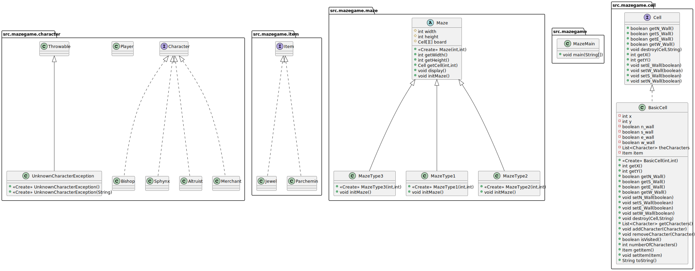
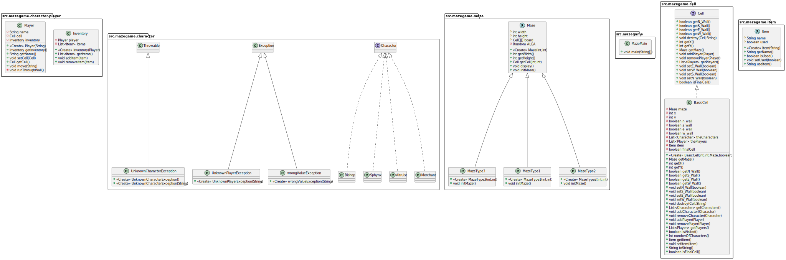
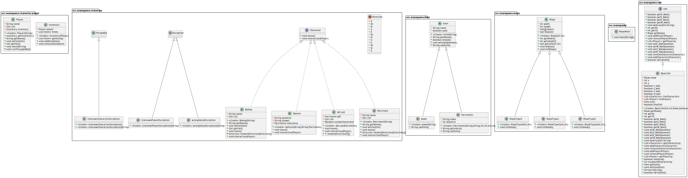
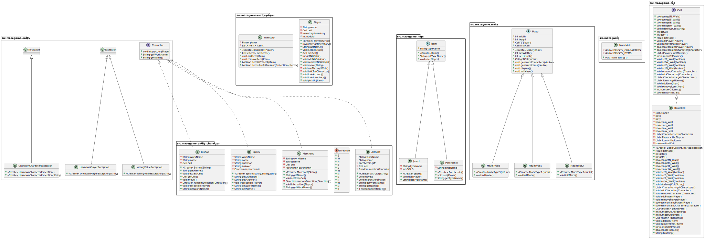

# l2s4-projet-2022 | Projet de Java 2022

# Sommaire

Journal de bord (Semaine) : [1](#semaine-1) [2](#semaine-2) [3](#semaine-3) [4](#semaine-4) [5](#semaine-5) [6](#semaine-6) [7](#semaine-7) [8](#semaine-8) [9](#semaine-9) [10](#semaine-10) [11 & 12](#semaine-11-&-12) [13](#semaine-13) [14](#semaine-14) [15](#semaine-15) [16](#semaine-16)

---

# Equipe

- [Abdennour HADDAD](mailto:abdennour.haddad.etu@univ-lille.fr)
- [Samuel CARPENTIER](mailto:samuel.carpentier.etu@univ-lille.fr)

---

# Sujet & délais

### [Le sujet 2022](./data/sujet2022%20.pdf)

| Livrable   | Travail à réaliser                     | Échéance         |
|------------|----------------------------------------|------------------|
| Livrable 1 | Modélisation du labyrinthe             | Semaine du 21/02 |
| Livrable 2 | Modélisation des objets et personnages | Semaine du 21/03 |
| Livrable 3 | Modélisation des actions               | Semaine du 25/04 |
| Livrable 4 | Modélisation complète                  | Semaine du 09/05 |

---

# Compilations et executions

### Compilation des tests

Pour compiler les tests veuillez taper la commande suivant dans un terminal à partir du dossier racine du projet :
`javac -classpath test4poo.jar test/mazegame/*.java`

**NOTE :** Si vous voulez uniquement compiler un fichier de test précis, vous pouvez remplacer `*` par un **nom de fichier** se localisant dans le dossier **test** à partir du dossier actuel.

### Execution des tests

_Suite à la compilation des fichiers de tests_ vous pouvez les exécuter avec la commande suivante à partir d'un terminal pointant le dossier racine :
`java -jar test4poo.jar mazegame.FileTest`

**NOTE :** Ici vous exécuterez les tests de **test/mazegame/FileTest**. Vous pouvez lancer d'autres tests en remplaçant ImageTest par un autre nom de fichier de test situé dans le dossier **test** depuis le dossier actuel. (Attention à ne **pas** mettre d'extensions dans la commande.)

---

# Livrables

## Livrable 1

### Atteinte des objectifs

Oui, cependant il nous reste les tests à faire. (+Il nous reste un algo de génération du labyrinthe à faire)

### Difficultés restant à résoudre

Il faut que nous nous occupions de toutes les autres classes du projet afin de respecter le cahier des charges.

### UML du livrable

## Livrable 2

### Atteinte des objectifs

NON cependant, il nous manque un algorithme de génération du labyrinthe. Il nous reste les tests à faire.

### Difficultés restant à résoudre

Il faut continuer le développement des actions

### UML du livrable

## Livrable 3

### Atteinte des objectifs

Non, il nous manque quelques actions à modéliser, tel que **regarder** pour le joueur...
Il nous manque aussi les boites interactions pour les PNJs, ainsi que l'apparition des objets sur le sol
(+ Toujours un algorithme de génération de labyrinthe ainsi que les tests des méthodes)

### Difficultés restant à résoudre

Les objectifs non atteints sont à réaliser ainsi que le peaufinage du projet.

### UML du livrable

## Livrable 4

### Atteinte des objectifs

### UML du livrable

---

# Journal de bord

## Semaine 1

Synthèse du sujet en prévision de la création des diagrammes UML.

### Objectifs à venir

- [x] Apprendre git
- [ ] Faire UML du labyrinth
- [ ] Commencer les classes
- [ ] Essayer de voir comment implémenter les algos de génération du labyrinthe

---

## Semaine 2

Creation du diagramme UML sur l'outil GenMyModel en vue d'une génération automatique du squelette du projet.

[Lien vers GenMyModel (Peux être mis à jour en fonction de l'état du projet)](https://app.genmymodel.com/api/projects/_sKAkgIWREeyxbevs_zeV6g/diagrams/_sKAkg4WREeyxbevs_zeV6g/svg)

### Objectifs à faire pour la prochaine semaine

- [ ] Commencer les classes du package cell
- [x] Commencer la génération du maze (Avec tous les murs, par défaut) avec les inputs dans la console
- [ ] Commencer les classes du package maze (Algo 2)
- [ ] Commencer les classes du package maze (Algo 3)

---

## Semaine 3

Les inputs pour commencer la génération d'un labyrinthe et la création de celui-ci sont fonctionnels.
Pour l'instant seul le labyrinthe sans algorithme est disponible (Tous les murs sont présents). L'implémentation des algorithmes se fera dès la [semaine 4](#semaine-4) et [5](#semaine-5).

### Difficultés rencontrées lors de la semaine précédente

- Compliqué d'avancer sur la génération par défaut du maze si les classes des cells ne sont pas faites. J'ai donc fait les méthodes nécessaires afin de pouvoir avancer.

- Si besoin nous pouvons faire des vocales sur Discord si vous avez un problème ou si vous avez besoin de débriefer sur le squelette du projet pour pouvoir avancer sur votre partie. Il faut juste me prévenir sur le groupe.

### Objectifs à faire pour les 2 prochaines semaines

- [x] Faire les classes du package `src.mazegame.cell`
- [x] Faire la classe du package `src.mazegame.maze` (Algo 1)
- [ ] Faire la classe du package `src.mazegame.maze` (Algo 2)
- [x] Faire la classe du package `src.mazegame.maze` (Algo 3)

---

## Semaine 4

_(Vacances)_

### Attention _DERNIER DELAI_ pour fournir le premier livrable la semaine prochaine

---

## Semaine 5

### [Premier Livrable](#livrable-1)

### Difficultés rencontrées lors des 2 semaines précédentes

- J'ai eu du mal à comprendre le fonctionnement exact des Switch dans le main.
Nous avons eu plusieurs problèmes dû à leur utilisation

### Objectifs à faire pour la prochaine semaine

- Se répartir les taches pour sur la modélisation des objets et des personnages

---

## Semaine 6

### Voici les tâches à se répartir

- Faire les personnages **Sphynx**, **Altruist** et l'interface **Character** (PNJ)
- Faire les personnes **Bishop** et **Merchant** (PNJ)
- Faire la class **Player** (L'héro) et changement de l'affichage
- Faire l'interface **Item** et les classes **Jewel** et **Parchemin** (Les objets)

### Aide : Voir la [synthèse du sujet](#semaine-1) et le [diagramme ULM](#semaine-2)

### Difficultés rencontrées lors de la semaine précédente

- Je suis tombé très malade, je n'ai pas vraiment pu travailler sur le projet

### Objectifs à faire pour les 2 prochaines semaines

- Faire les personnages **Sphynx**, **Altruist** et l'interface **Character** (PNJ)  
- Faire les personnes **Bishop** et **Merchant** (PNJ)  
- Faire la class **Player** (Le héros) et changement de l'affichage  
- Faire l'interface **Item** et les classes **Jewel** et **Parchemin** (Les objets)

---

## Semaine 7

_(Semaine de DS intermédiaire)_

- [x] Faire les personnages **Sphynx**, **Altruist** et l'interface **Character** (PNJ)  

- [x] Faire la class **Player** (L'héro) et changement de l'affichage  
Class Player,
modification du main pour demander ou le joueur veux aller à chaque tour,
modification du display pour qu'il affiche le joueur,
modification des classes cell.s pour prendre en compte qu'il y a un joueur dessus.  
Ajout de dernière minute :  
Ajout de l'inventaire pour le(s) joueur(s).
- [x] Faire les personnes **Bishop** et **Merchant** (PNJ)  

- [x] Faire l'interface **Item** et les classes **Jewel** et **Parchemin** (Les objets)  

### ⚠ Attention _DERNIER DELAI_ pour fournir le second livrable la semaine prochaine

---

## Semaine 8

- Ajout de la sortie du maze et changement de l'affichage du labyrinthe.

### [Second Livrable](#livrable-2)

---

## Semaine 9

- Début d'ajout des items et du parchemin

---

## Semaine 10

- Continuation du développement des items (Joyaux & Parchemin)

---

## Semaine 11 & 12

_(Vacances)_

### ⚠ Attention _DERNIER DELAI_ pour fournir le troisième livrable la semaine de la rentrée

---

## Semaine 13

Conclusion de ce que l'on a fait et répartition des dernières tâches à faire.

À faire cette semaine :

- Interactions entre le hero et les autres personnages **dialogue** et **échange** d'indices (Voir la [semaine 1](#semaine-1)
ou le [sujet](#sujet--dlais) pour en savoir plus)
- Faire apparaitre des objets (Joyaux) sur le sol aléatoirement
- Interaction ramasser pour le joueur

### [Troisième Livrable](#livrable-3)

---

## Semaine 14

Correction de certaines classes qui bloquait la compilation du programme.

À faire cette semaine :

- Faire les tests de toutes les méthodes du projet

### ⚠ Attention _DERNIER DELAI_ pour fournir le dernier livrable la semaine prochaine

---

## Semaine 15

À faire cette semaine :

- Terminer toutes les actions complémentaires :

> **Regarder** autour, **ramasser** pour le héros, regarder dans l'**inventaire**, utiliser les **objets**.  
> ~~Modifier le display pour afficher les **PNJs** et les **Objets** sur le sol.~~ _(Choix du groupe de ne pas les afficher finalement)_  
> **Générer** un certain nombre de PNJ aléatoirement dans le labyrinthe.  
> Faire le **makefile** pour générer le programme
___  
> **Interface de discussion** entre le héros et les PNJs. (⚠ Mettez-vous d'accord pour qu'il y ait
  la même forme d'affichage pour toutes les interfaces des PNJ) (Seront lancé quand le joueur choisi d'interagir avec le PNJ de la case sur la quel il est)  
  **Echange d'indices** et d'**objets** avec l'inventaire du héros
  (Voir la [semaine 1](#semaine-1) ou le [sujet](#sujet--dlais) pour en savoir plus)

>  
> ~~Faire apparaitre un certain nombre d'objets (Joyaux) **sur le sol** aléatoirement~~  
> ~~Faire les **UML** pour chaque livrable (Voir le générateur automatique _Ref Mr. Routier_)~~

> _**Tout le monde :**_  
> Faire _tous_ les **tests**  
  (Voir [Compilation et execution](#compilations-et-executions))

🔗 En cas de besoin merci d'utiliser le [discord du projet](https://discord.com/channels/@me/937694389403263037)

### [Dernier Livrable](#livrable-4)

---

## Semaine 16

> ### Corrections de bugs

> - Altruiste ne fonctionnait pas
> - Résolution des problèmes d'encodages sur certains fichiers
> - Résolution du bug qui faisait que parfois le laby n'avait pas de sortie
> - Correction des bugs de l'ajout d'items à l'inventaire

> ### Modifications

> - Changement de l'affichage des des PNJs pour ne plus afficher leurs métiers mais leur prénoms

> ### Ajouts

> - Générations des UMLs (Pour tout les livrables)
> - Makefile

>
> - Nouvelles modifications dans les classes Parchemin, Jewel et l'interface Item
> - Ajout des objets dans le labyrinthe
> - Interactions entre Altruist, Bishop, Merchant, Sphynx et le joueur
> - Tests des méthodes des classes BasicCell, Parchemin et Jewel

À savoir faire pour la soutenance :  
Savoir comment faire pour rajouter un nouvel élément dans le projet.

_(Semaine des DS finaux)_

### ⚠ _Soutenance_ cette semaine ⚠
